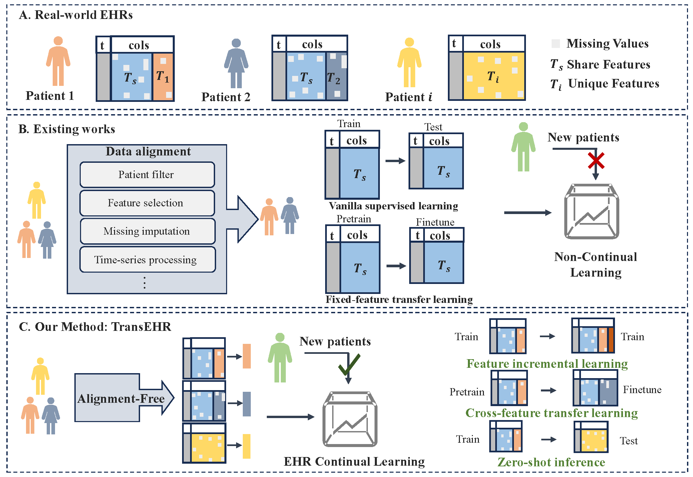

# TransEHR: Alignment-Free Electronic Health Records Continual Learning Across Feature Spaces



## Abstract
With the emergence of new Electronic Health Records (EHR), incrementally updating predictive models becomes crucial for effective health monitoring. However, in real clinical scenarios, the feature space of EHRs may change over time, which poses a unique challenge to the transferability of predictive models when encountering unseen medical features. To tackle this issue, we propose TransEHR, a Transferable  EHR incremental learner across feature space. Initially, TransEHR divides EHR over time into binary groups composed of feature names and values, embedding time and binary groups separately. This embedding mechanism enables the model to accept variable-feature inputs, which solves the problem of feature space evolving for new EHR. Subsequently, to learn temporal information, a variant transformer with gating units is applied to the contextual representation of time and record embeddings. Furthermore, TransEHR designs a record-level self-supervised contrastive loss to capture the semantics within and across features for enhancing intra-patient semantic consistency and a patient-level supervised contrastive loss for mitigating inter-patient intra-class semantic bias and catastrophic forgetting problem faced in incremental learning. Experiments in supervised learning, feature incremental learning, and cross-feature transfer learning demonstrate that TransEHR outperforms state-of-the-art methods, providing accurate and stable predictions.

## Quick Start

### Requirements

```
pip install -r requirements.txt
```

### Datasets 

- Download

The datasets can be downloaded from the following links:
1) [MIMIC-III](https://github.com/SCXsunchenxi/mimic3-benchmarks)
2) [MIMIC-IV](https://physionet.org/content/mimiciv/3.1/)
3) [COVID-19](https://github.com/SCXsunchenxi/CCTS/tree/main/data) and [HM Hospital](https://www.hmhospitales.com/)
4) [PhysioNet Cardiology Sepsis](https://physionet.org/content/challenge-2019/1.0.0/)

- Pre-processing


For `MIMIC-III` Dataset, the data pre-processing follow the [mimic3-benchmarks](https://github.com/YerevaNN/mimic3-benchmarks), For `COVID-19` and `Sepsis`, the run the data_preprocess.ipynb.

### Examples
These are source code examples(Train and Inference） for the `COVID-19` and `mimic_sepsis` dataset.

- Pre-processing

    run `data_preprocess.ipynb`

- Load dataset

```
# load dataset by passing data name and task name
train_dataset, val_dataset, test_dataset, num_train_set, cat_cols, num_cols, bin_cols = transEHR.load_data('../data/covid19/', 'mortality_prediction')
```

- Build model

```
model = TransEHRClassifier(
        categorical_columns = cat_cols,
        numerical_columns = num_cols,
        binary_columns = bin_cols,
        num_class=2,
        hidden_dim=128,
        num_layer=2,
        num_attention_head=8,
        hidden_dropout_prob=0,
        ffn_dim=256,
        activation='relu',
        device='cuda:0',
    )
```

- Traing

```
trainer = Trainer(
        model,
        train_dataset,
        test_dataset,
        **training_arguments,
    )

trainer.train()
```

Note: Detailed training codes can be referenced `examples/covid_train.py`


- Predict

    run `covid_predict.ipynb`
